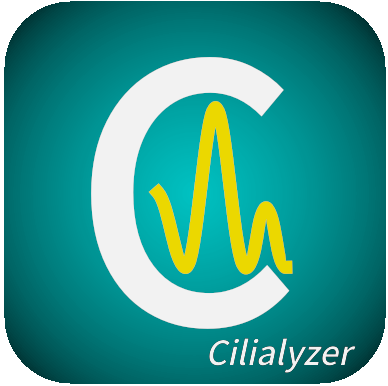

The Cilialyzer software  &nbsp;   
=======================

Description
-----------

Primary ciliary dyskinesia (PCD) is a rare genetic disorder causing a 
flawed ciliary structure, which predominantly leads to an impaired 
mucociliary clearance and associated airway disease. 
As there is currently no single gold standard test,
PCD is diagnosed by a combination of several tests comprising genetic testing 
as well as several techniques examining the ciliary structure and function. 
High-speed video microscopy (HSVM) allows to directly observe the ciliary 
motion. Among the approved diagnositc methods, HSVM therefore represents the 
most direct method to assess ciliary function. 

The **Cilialyzer** is a highly user-oriented freely available open-source 
software specifically designed to support the clinical analysis of the ciliary 
motion in respiratory cells of PCD-suspects captured by high-speed 
videomicroscopy.

The **Cilialyzer** software enables diagnostic specialists to **load**, 
**preprocess** (e.g. **image registration** and **contrast enhancement**) 
and to replay the image sequences with a feature-rich replaying module 
facilitating and improving  the visual assessment of ciliary function. 
The software furthermore allows to comfortably compute the 
**ciliary beating frequency (CBF)** as well as the **activity map**, 
and contains a simple-to-use **particle tracking** module. 

Contact
-------
You are welcome to contact me with any questions you may have: martin.schneiter@gmx.ch
